# ENTREGA: CampusTasks — actualización y eliminación de tareas

Universidad del Valle — Ingeniería de Sistemas
Desarrollo de Software II

---

## 1. Datos

| Campo | Valor |
|---|---|
| Integrante 1 | Rigoberto Ospina — 2459488 |
| Integrante 2 | Miguel Sanclemente — [[código de Miguel]] |
| Fecha | 06/10/2026 |
| Rama | `miguel-rigo` |
| URL de la rama | https://github.com/TevenV27/campus-task/tree/miguel-rigo |

---

## 2. Puesta en marcha

### 2.1 Node.js

Se usó Node.js 24.x, como exige el proyecto.

```bash
node -v
npm -v
```

Resultado: Node `v24.16.0` y npm `11.13.0`.

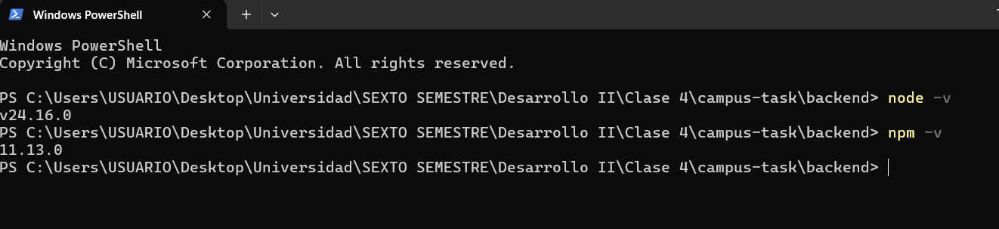

### 2.2 PostgreSQL

Se instaló PostgreSQL 18.0 en Windows con el instalador oficial. La conexión se comprobó con **SQL Shell (psql)**, usando el usuario `postgres`, el servidor `localhost` y el puerto 5432. Al conectar apareció el prompt `campus_tasks=#`, lo que confirma que el servicio está activo y que la base existe.

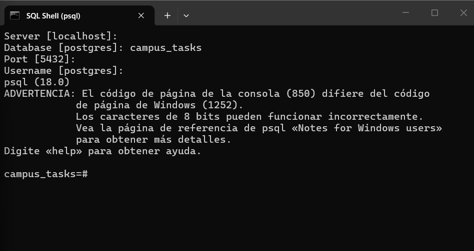

### 2.3 Base de datos, tabla y datos iniciales

El repositorio no trae scripts SQL, así que la base se creó a mano. Dentro de `psql`:

```sql
CREATE DATABASE campus_tasks;
\c campus_tasks
CREATE TABLE tareas (id SERIAL PRIMARY KEY, titulo TEXT NOT NULL);
INSERT INTO tareas (titulo) VALUES
 ('Leer la guía de la clase 2'),
 ('Preparar el entorno de desarrollo');
```

Comprobación con `SELECT * FROM tareas;`, que muestra las dos filas iniciales.

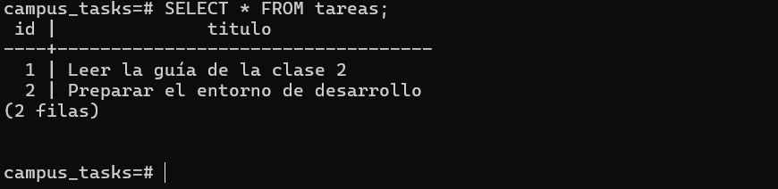

### 2.4 Archivo `backend/.env`

Se creó el archivo `backend/.env` con las siguientes variables (los valores no se muestran por seguridad):

```
DB_HOST
DB_PORT
DB_USER
DB_PASSWORD
DB_NAME
```

Al principio el backend falló con el error `no existe el rol «USUARIO»`: el archivo `.env` no estaba en la carpeta `backend`, así que el servidor no leyó la configuración y usó el nombre de usuario de Windows. Se creó el archivo en `backend/.env` y se reinició el servidor.

El archivo está ignorado por el `.gitignore` de la raíz y no se subió a Git. Tampoco se subió la carpeta `.idea/` del IDE.

### 2.5 Backend

```bash
cd backend
npm ci
npm run start:dev
```

Comprobación: `http://localhost:3000/tareas` devuelve las tareas iniciales en JSON. En el arranque, Nest registra las cuatro rutas: `GET`, `POST`, `PATCH /tareas/:id` y `DELETE /tareas/:id`.

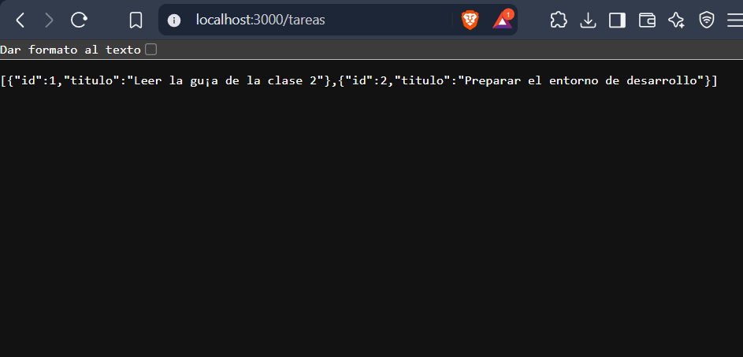

### 2.6 Frontend

```bash
cd frontend
npm ci
npm start
```

Comprobación: en `http://localhost:4200` aparecen las tareas, cada una con los botones **Editar** y **Eliminar**. El frontend se mantiene en el puerto 4200 porque el backend solo habilita CORS para ese origen.

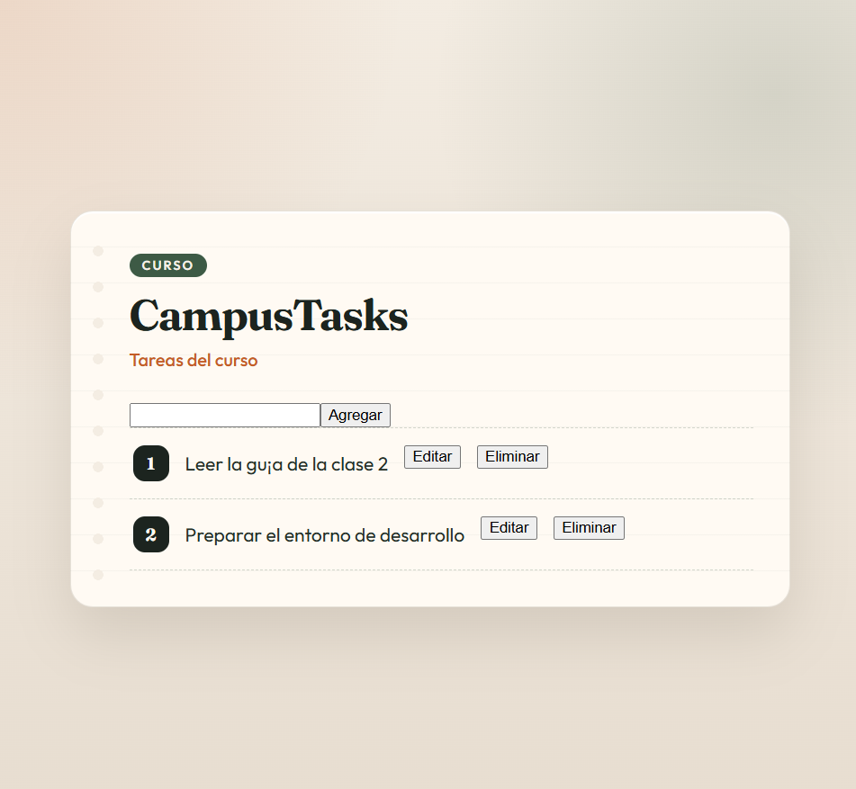

---

## 3. Lectura de los ejemplos

El repositorio ya traía tres archivos de prueba. Se leyeron antes de escribir las nuevas pruebas y se reutilizó su patrón.

### 3.1 `backend/src/tareas/tareas.service.spec.ts` (unitaria)

Crea un `TestingModule` con `TareasService` y un `DatabaseService` simulado, cuyo método `query` es un `jest.fn()`. La prueba llama directamente al método del servicio y verifica el valor devuelto y los argumentos exactos con los que se llamó a `query` (texto SQL y parámetros). No necesita base de datos.

### 3.2 `backend/src/tareas/tareas.integration.spec.ts` (integración)

Usa el mismo `TestingModule`, pero incluye también `TareasController`. Levanta una aplicación Nest y hace peticiones HTTP reales con `supertest`. Además de lo que verifica la unitaria, comprueba la ruta, el código de estado y el cuerpo de la respuesta. `query` sigue siendo simulado.

### 3.3 `frontend/src/components/tareas/tareas.component.spec.ts` (componente)

Prueba con Jasmine y Karma. `TareasService` se reemplaza por un spy creado con `jasmine.createSpyObj`, así que no se necesita el backend. Se monta `TareasComponent`, se simulan clics sobre los botones y se revisan los argumentos del spy y lo que aparece en pantalla.

### 3.4 Patrón reutilizado: preparar, ejecutar, verificar

| Paso | Backend | Frontend |
|---|---|---|
| Preparar | Definir qué devuelve `query` (objeto con `rows`) | Definir qué devuelve el spy y renderizar el componente con la lista inicial |
| Ejecutar | Llamar al método del servicio o hacer la petición con `supertest` | Simular la acción del usuario: escribir en el campo y hacer clic |
| Verificar | Valor devuelto, código de estado y argumentos de `query` | Argumentos del spy y contenido del DOM |

No se tomó como modelo `backend/test/app.e2e-spec.ts`, porque levanta `AppModule` completo e intenta usar PostgreSQL real.

---

## 4. Implementación

### 4.1 Backend

#### Servicio (`backend/src/tareas/tareas.service.ts`)

```typescript
async actualizar(id: number, titulo: string): Promise<Tarea> {
  const resultado = await this.db.query<Tarea>(
    'UPDATE tareas SET titulo = $1 WHERE id = $2 RETURNING id, titulo',
    [titulo, id],
  );
  if (resultado.rows.length === 0) {
    throw new NotFoundException(`La tarea ${id} no existe`);
  }
  return resultado.rows[0] as Tarea;
}

async eliminar(id: number): Promise<Tarea> {
  const resultado = await this.db.query<Tarea>(
    'DELETE FROM tareas WHERE id = $1 RETURNING id, titulo',
    [id],
  );
  if (resultado.rows.length === 0) {
    throw new NotFoundException(`La tarea ${id} no existe`);
  }
  return resultado.rows[0] as Tarea;
}
```

SQL usado:

| Método | SQL |
|---|---|
| `actualizar` | `UPDATE tareas SET titulo = $1 WHERE id = $2 RETURNING id, titulo` |
| `eliminar` | `DELETE FROM tareas WHERE id = $1 RETURNING id, titulo` |

Ambas consultas usan parámetros posicionales (`$1`, `$2`) y nunca concatenan valores en el texto SQL, igual que `crear`. Así se evita la inyección SQL.

#### Controlador (`backend/src/tareas/tareas.controller.ts`)

```typescript
@Patch(':id')
actualizar(
  @Param('id', ParseIntPipe) id: number,
  @Body('titulo') titulo: string,
) {
  return this.tareasService.actualizar(id, titulo);
}

@Delete(':id')
eliminar(@Param('id', ParseIntPipe) id: number) {
  return this.tareasService.eliminar(id);
}
```

| Ruta | Cuerpo | Si la tarea existe | Si no existe |
|---|---|---|---|
| `PATCH /tareas/:id` | `{ "titulo": "..." }` | 200 y la tarea actualizada | 404 |
| `DELETE /tareas/:id` | ninguno | 200 y la tarea eliminada | 404 |

#### Decisión 1: cómo se convierte el `:id` a `number`

El `:id` llega como texto en la URL. Se usó `ParseIntPipe` de NestJS en `@Param('id', ParseIntPipe)`. El pipe convierte el texto a entero antes de que el valor llegue al servicio, y responde automáticamente 400 si no es un entero válido (por ejemplo `/tareas/abc`). Se eligió porque evita convertir a mano con `Number()` y mantiene la validación en el borde de la aplicación, de modo que el servicio siempre recibe un `number`.

#### Decisión 2: cómo se detecta que la tarea no existe (404)

Ambas sentencias usan `RETURNING`. Si ninguna fila coincide con el `id`, `rows` queda vacío, y en ese caso el servicio lanza `NotFoundException`, que NestJS traduce a una respuesta 404. Se eligió este enfoque porque con una sola consulta se modifica o borra y a la vez se sabe si la tarea existía. Un `SELECT` previo costaría una consulta más y dejaría un intervalo en el que otra petición podría borrar la tarea antes de actualizarla.

### 4.2 Frontend

#### Servicio HTTP (`frontend/src/components/tareas/tareas.service.ts`)

```typescript
actualizar(id: number, titulo: string): Observable<Tarea> {
  return this.http.patch<Tarea>(`${this.apiUrl}/tareas/${id}`, { titulo });
}

eliminar(id: number): Observable<Tarea> {
  return this.http.delete<Tarea>(`${this.apiUrl}/tareas/${id}`);
}
```

Ambos métodos devuelven la tarea que responde el backend, igual que `crear`.

#### Componente (`tareas.component.ts` y `tareas.component.html`)

Se agregaron dos signals:

- `editandoId`: id de la tarea que se está editando, o `null`.
- `mensajeError`: texto que se muestra si una operación falla.

Comportamiento de la interfaz:

| Acción | Qué hace el usuario | Qué ocurre |
|---|---|---|
| Editar | Pulsa **Editar** en una tarea | Esa tarea cambia a un campo de texto con su título actual y un botón **Guardar** |
| Guardar | Cambia el título y pulsa **Guardar** | Se llama a `actualizar(id, titulo)`. Dentro de la respuesta, `map` reemplaza solo la tarea con ese id por la que devolvió el backend y se sale del modo edición |
| Eliminar | Pulsa **Eliminar** en una tarea | Se llama a `eliminar(id)`. Dentro de la respuesta, `filter` quita esa tarea y las demás siguen visibles |

La lista en pantalla solo cambia dentro del `next` del `subscribe`, es decir, cuando el backend respondió con éxito y nunca antes de llamarlo. Los botones usan exactamente los textos **Editar**, **Guardar** y **Eliminar**.

#### Qué pasa en pantalla ante un error (por ejemplo 404)

Si el backend responde con error, el callback `error` del `subscribe` llama a `manejarError()`, que:

1. Sale del modo edición (`editandoId` pasa a `null`).
2. Muestra un mensaje indicando que la operación no se pudo completar y que la tarea pudo haber sido eliminada.
3. Vuelve a pedir la lista al backend para que la pantalla refleje el estado real.

Se eligió recargar la lista porque un 404 significa que la lista local está desactualizada, por ejemplo si otra persona ya eliminó esa tarea. Mostrar solo el error dejaría en pantalla una tarea que ya no existe.

#### Limitaciones conocidas

- Ni el frontend ni el backend validan que el título esté vacío.
- `crear` en el frontend no maneja errores (el taller no lo pedía).
- El mensaje de error solo se limpia al pulsar **Editar**.
- No hay una prueba de componente para el caso de error del backend.

---

## 5. Pruebas

### 5.1 Pruebas nuevas del backend

| Archivo | Prueba | Qué verifica |
|---|---|---|
| `tareas.service.spec.ts` | Actualiza el título y devuelve la fila actualizada | `query` recibe el `UPDATE` con `['Título nuevo', 1]` y el método devuelve la fila |
| `tareas.service.spec.ts` | Elimina la tarea y devuelve la fila eliminada | `query` recibe el `DELETE` con `[1]` y el método devuelve la fila eliminada |
| `tareas.integration.spec.ts` | `PATCH /tareas/:id` actualiza el título y responde 200 | Envía `{ titulo }`, responde 200 con la tarea actualizada y `query` recibe los argumentos esperados |
| `tareas.integration.spec.ts` | `PATCH /tareas/:id` responde 404 si no existe | Con `rows: []`, responde 404 |
| `tareas.integration.spec.ts` | `DELETE /tareas/:id` elimina la tarea y responde 200 | Responde 200 con la tarea eliminada y `query` recibe el `DELETE` con `[1]` |
| `tareas.integration.spec.ts` | `DELETE /tareas/:id` responde 404 si no existe | Con `rows: []`, responde 404 |

Resultado de `npm test` en `backend`:

```bash
cd backend
npm test
```

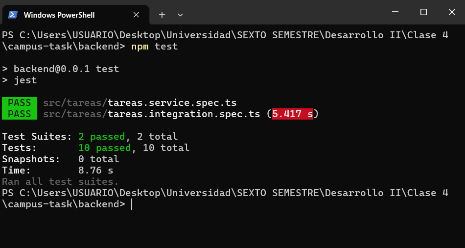

### 5.2 Pruebas nuevas del frontend

| Prueba | Qué verifica |
|---|---|
| Edita una tarea al pulsar Editar y Guardar | Tras pulsar **Editar**, escribir un título y pulsar **Guardar**, `actualizar` se llamó con `(1, 'Guía leída')`, la pantalla muestra el título nuevo y la otra tarea no cambia |
| Elimina una tarea al pulsar Eliminar | Tras pulsar **Eliminar**, `eliminar` se llamó con `1`, la tarea desaparece de la pantalla y la otra sigue visible |

Las pruebas anteriores (listar y agregar) siguen en el mismo archivo, sin cambios en lo que verifican. El spy ahora incluye también `actualizar` y `eliminar`.

Resultado de `npm test` en `frontend`:

```bash
cd frontend
npm test
```

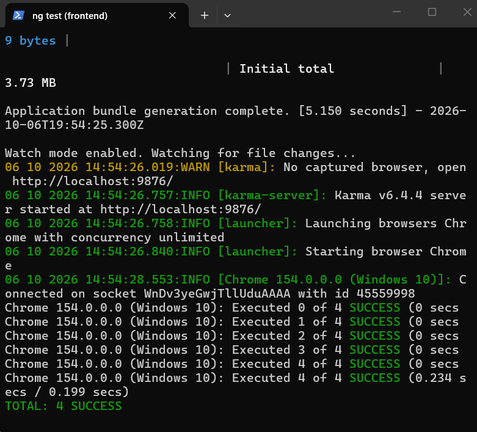

### 5.3 Pruebas manuales del backend con la base real

Se usó `curl.exe` desde PowerShell, con el cuerpo JSON en archivos temporales para evitar problemas con las comillas. Primero se creó una tarea de prueba (id 3), luego se editó y se eliminó, y por último se probaron ids que no existen:

```powershell
curl.exe -i -X POST http://localhost:3000/tareas -H "Content-Type: application/json" -d "@$env:TEMP\crear.json"
curl.exe -i -X PATCH http://localhost:3000/tareas/3 -H "Content-Type: application/json" -d "@$env:TEMP\editar.json"
curl.exe -i -X DELETE http://localhost:3000/tareas/3
curl.exe -i -X PATCH http://localhost:3000/tareas/999 -H "Content-Type: application/json" -d "@$env:TEMP\editar.json"
curl.exe -i -X DELETE http://localhost:3000/tareas/999
```

| Petición | Respuesta |
|---|---|
| `POST /tareas` | `201 Created` — `{"id":3,"titulo":"Tarea de prueba"}` |
| `PATCH /tareas/3` | `200 OK` — `{"id":3,"titulo":"Titulo editado"}` |
| `DELETE /tareas/3` | `200 OK` — devuelve la tarea eliminada |
| `PATCH /tareas/999` | `404 Not Found` — `La tarea 999 no existe` |
| `DELETE /tareas/999` | `404 Not Found` — `La tarea 999 no existe` |

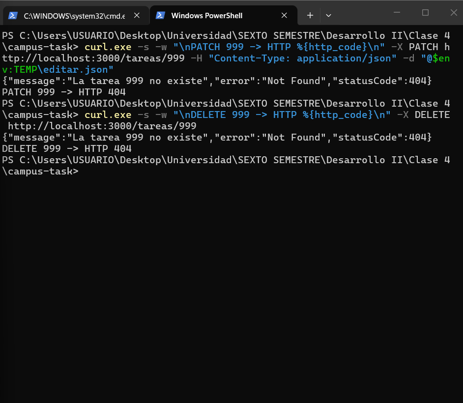

### 5.4 Prueba manual del frontend contra el backend real

En `http://localhost:4200` se probó el flujo completo y se comprobó el cambio con `GET /tareas`.

Lista de tareas antes de las operaciones:

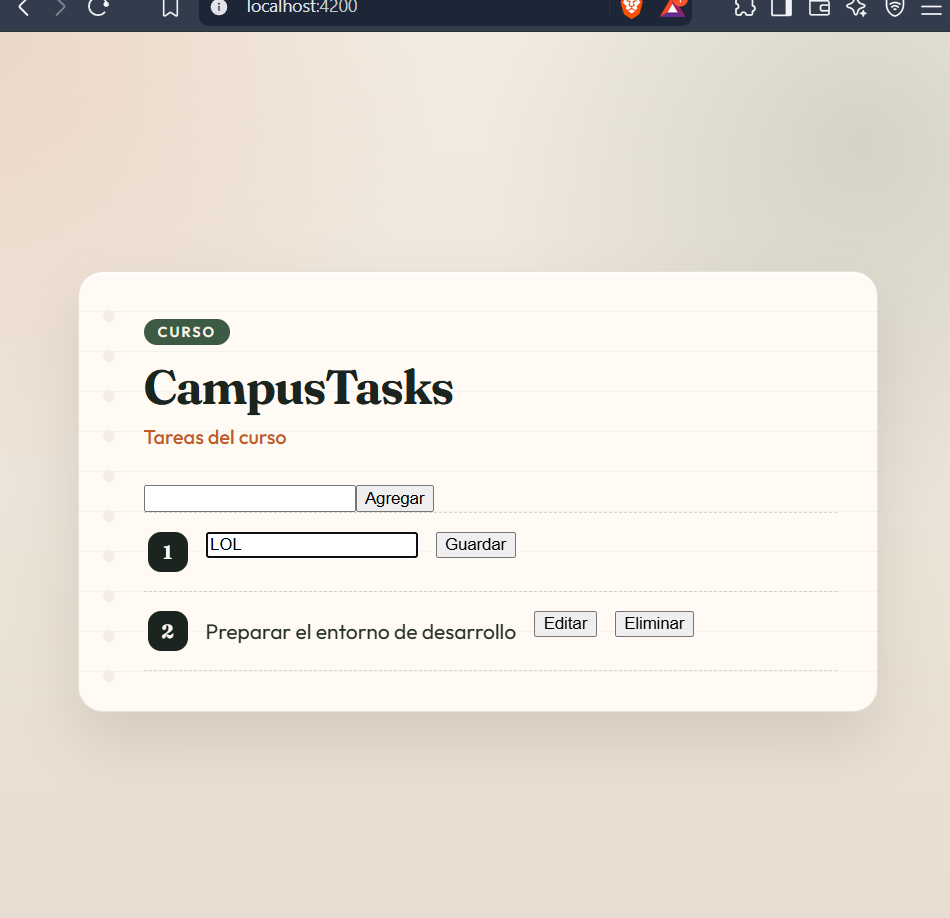

Tarea editada con **Editar** y **Guardar**:

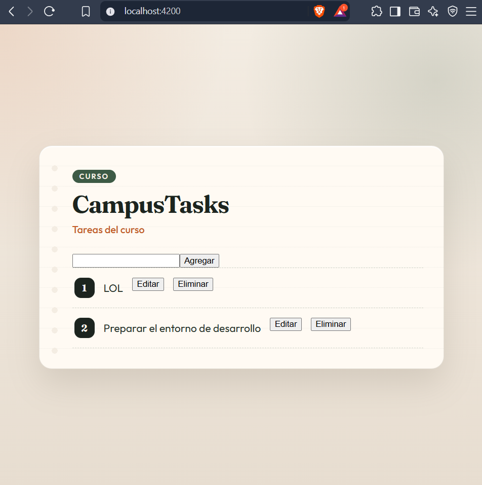

Tarea eliminada con **Eliminar**:

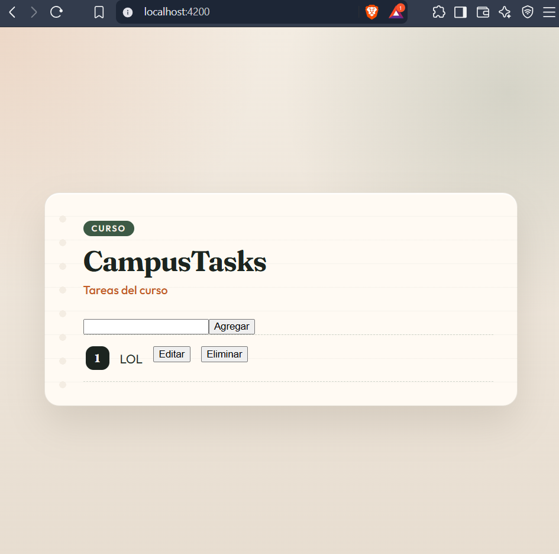

`GET /tareas` después de los cambios:

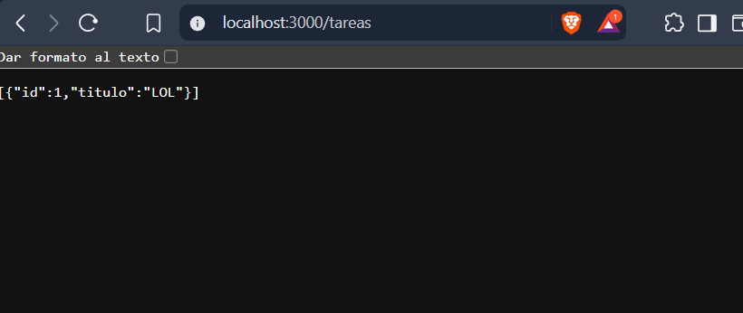

---

## 6. Git

Comandos usados:

```bash
git fetch origin
git checkout miguel-rigo
git status                  # se confirmó que .env y .idea/ no aparecen
git add <archivos>
git commit -m "Se agrega la edición y eliminación de tareas en backend y frontend con sus pruebas"
git push -u origin miguel-rigo
```

Estado y últimos commits de la rama:

```
PS> git status
On branch miguel-rigo
Your branch is up to date with 'origin/miguel-rigo'.

nothing to commit, working tree clean

PS> git branch --show-current
miguel-rigo

PS> git log --oneline -5
82e514a (HEAD -> miguel-rigo, origin/miguel-rigo) Carpeta con evidencias
b1c38db Documentacion sin capturas
e2b076b Fix formatting of 'Grupo de trabajo' section
9a979eb Add student IDs to team members in README
7a24fc6 Add workgroup section to README
```

Commit de la implementación: `b2a3225` — "Se agrega la edición y eliminación de tareas en backend y frontend con sus pruebas".

URL del commit: https://github.com/TevenV27/campus-task/commit/b2a3225

URL de la rama: https://github.com/TevenV27/campus-task/tree/miguel-rigo
