# ENTREGA: CampusTasks, editar y eliminar tareas

## 1. Datos

| Campo | Valor |
|---|---|
| Integrante | David Santiago Peña, código 2459611 |
| Integrante | Juan Sebastian Huertas, código 2459505 |
| Integrante | Gabriel Esteban Burbano Mora, código 2459358 |
| Fecha | 05/10/2026 |
| Rama | `gabesmo` |
| URL de la rama | https://github.com/TevenV27/campus-task/tree/gabesmo |
| Commit | https://github.com/TevenV27/campus-task/commit/d1b8a9e |

---

## 2. Puesta en marcha

### Sistema operativo

Intenté primero el taller en Windows, pero `postgres.exe` quedó bloqueado por la directiva de Device Guard (Smart App Control activado) y el servidor no arrancaba. Para no desactivar esa protección, realicé el taller en **Debian 13** (dual boot en mi computador personal).

Versiones usadas: Node.js `v24.21.0` (instalado con nvm), npm `11.19.0` y PostgreSQL `17.11`.

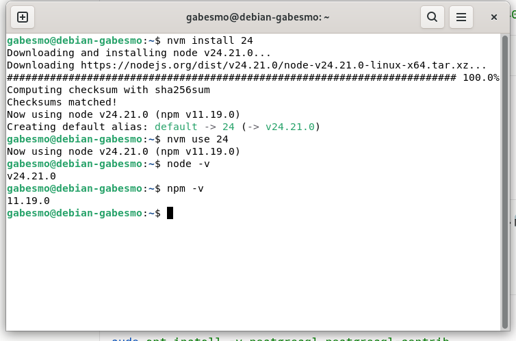

### PostgreSQL, base de datos y tabla

PostgreSQL se instaló con `sudo apt install postgresql postgresql-contrib` y el servicio quedó habilitado:

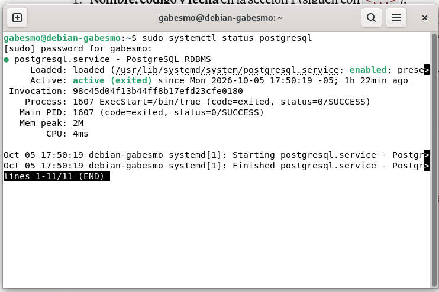

Luego se asignó contraseña al usuario `postgres` desde `sudo -u postgres psql` con `ALTER USER`. Luego se creó la base y la tabla:

```sql
CREATE DATABASE campus_tasks;
\c campus_tasks
CREATE TABLE tareas (id SERIAL PRIMARY KEY, titulo TEXT NOT NULL);
INSERT INTO tareas (titulo) VALUES
 ('Leer la guía de la clase 2'),
 ('Preparar el entorno de desarrollo');
SELECT * FROM tareas;
```

El `SELECT` devolvió las dos filas iniciales.

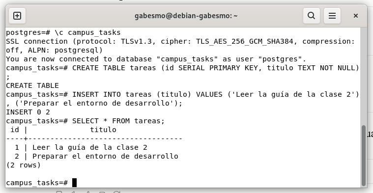

### Archivo `backend/.env`

Contiene estas variables (el valor de la contraseña no se muestra):

```
DB_HOST
DB_PORT
DB_USER
DB_PASSWORD
DB_NAME
```

El archivo está ignorado por el `.gitignore`, y `git status` no lo lista.

### Comprobación del backend y del frontend

Backend: `cd backend && npm ci && npm run start:dev`. En `http://localhost:3000/tareas` se ve el JSON con las dos tareas.

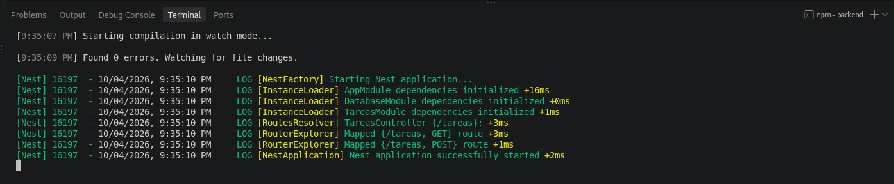

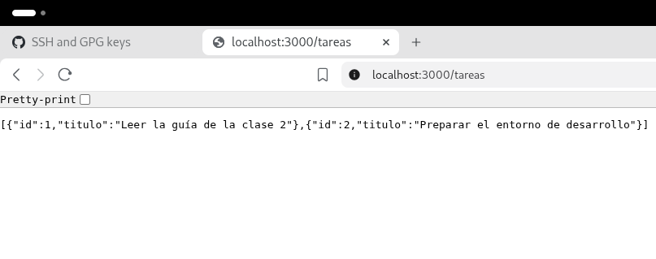

Frontend: `cd frontend && npm ci && npm start`, en `http://localhost:4200`.

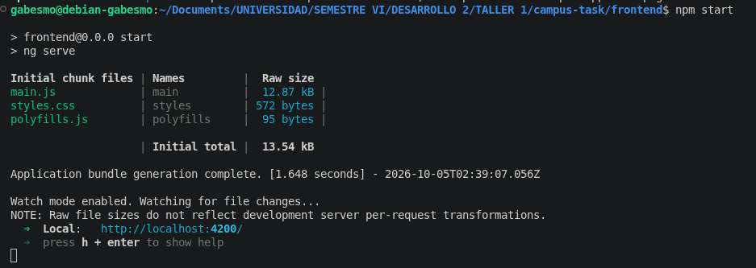

Pruebas de ejemplo antes de modificar nada: backend con 4 pruebas en verde y frontend con 2 pruebas en verde.

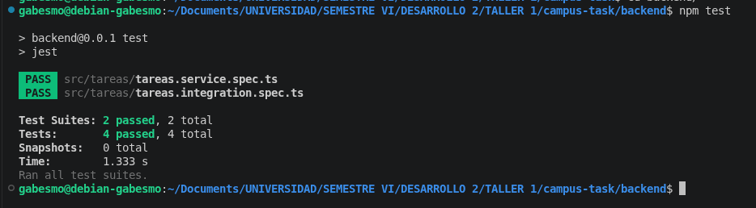

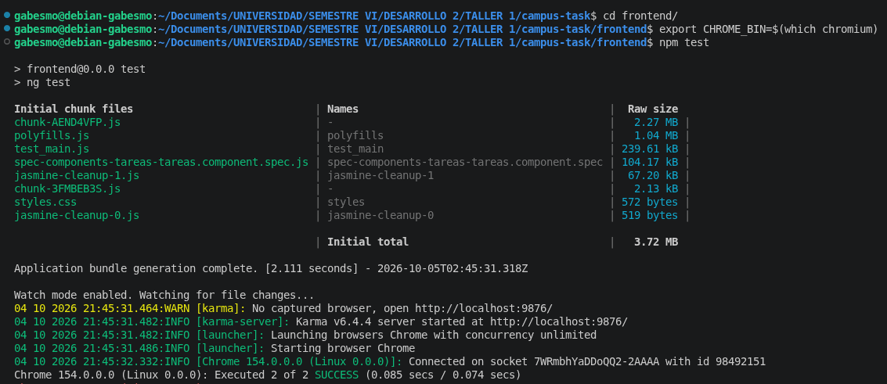

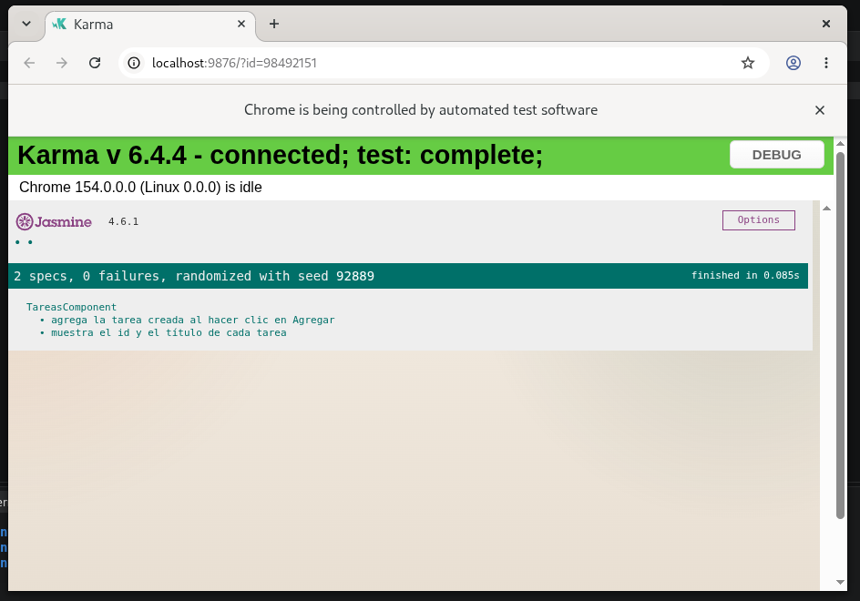

---

## 3. Lectura de los ejemplos

- **`tareas.service.spec.ts` (unitaria).** Prueba el servicio llamando directamente a sus métodos. `DatabaseService` se reemplaza por un objeto con `query` como `jest.fn()`, así que no se necesita base de datos. Verifica el valor devuelto y los argumentos exactos de `query` (SQL y parámetros).
- **`tareas.integration.spec.ts` (integración).** Monta controlador y servicio en un `TestingModule`, con `DatabaseService` simulado, y hace peticiones HTTP reales con `supertest`. Verifica además la ruta, el código de estado y el cuerpo de la respuesta.
- **`tareas.component.spec.ts` (componente).** Con Jasmine y Karma monta `TareasComponent` y reemplaza el servicio HTTP por un spy. Simula clics y revisa lo que aparece en pantalla.

**Patrón reutilizado en todas las pruebas nuevas: preparar, ejecutar, verificar.**

1. *Preparar:* definir qué devuelve `query` o el spy.
2. *Ejecutar:* llamar al método, hacer la petición o simular el clic.
3. *Verificar:* revisar el resultado, el código de estado, los argumentos recibidos y lo que muestra la pantalla.

---

## 4. Implementación

### Backend

**Servicio (`tareas.service.ts`)**, con consultas parametrizadas:

| Método | SQL |
|---|---|
| `actualizar(id, titulo)` | `UPDATE tareas SET titulo = $1 WHERE id = $2 RETURNING id, titulo` |
| `eliminar(id)` | `DELETE FROM tareas WHERE id = $1 RETURNING id, titulo` |

Si el id no existe, `RETURNING` no devuelve filas y el método entrega `undefined`.

**Controlador (`tareas.controller.ts`)**

| Ruta | Éxito | Id inexistente |
|---|---|---|
| `PATCH /tareas/:id` | 200 y tarea actualizada | 404 |
| `DELETE /tareas/:id` | 200 y tarea eliminada | 404 |

**Decisión 1: convertir `:id` a number.** Usé `ParseIntPipe`. Convierte el texto de la URL en un entero y, si no es un número (por ejemplo `/tareas/abc`), Nest responde 400 sin llegar al servicio.

**Decisión 2: detectar que la tarea no existe.** Si el servicio devuelve `undefined` (porque `RETURNING` no dio filas), el controlador lanza `NotFoundException` y Nest responde 404. Así el servicio solo ejecuta SQL y el controlador decide el código HTTP.

**Prueba manual con la base real (curl):**

`PATCH /tareas/1` respondió 200:

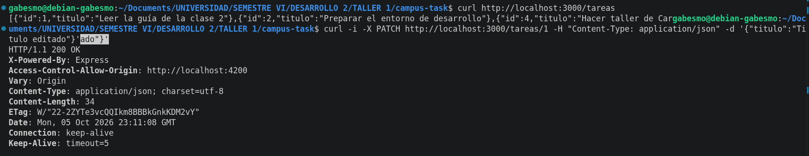

Se creó una tarea de prueba (201) y se eliminó con `DELETE` (200):

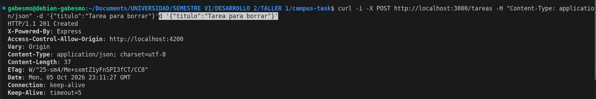

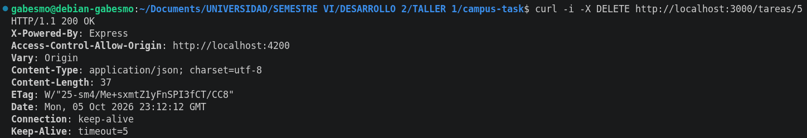

Con un id inexistente, ambas rutas respondieron 404:

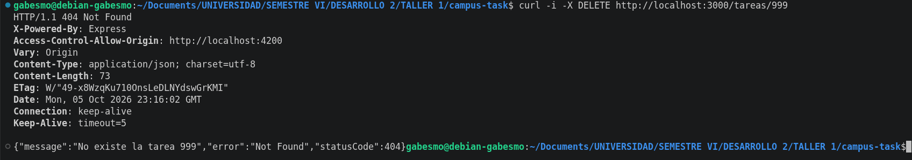

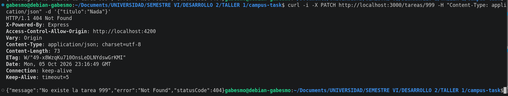

### Frontend

**Servicio HTTP (`tareas.service.ts`):** `actualizar(id, titulo)` envía `PATCH /tareas/:id` con `{ titulo }`, y `eliminar(id)` envía `DELETE /tareas/:id`. Ambos devuelven la tarea que responde el backend.

**Componente (`tareas.component.ts` y `.html`):** cada tarea tiene los botones **Editar** y **Eliminar**. Al pulsar **Editar** aparece un campo de texto con los botones **Guardar** y **Cancelar**. Se usan dos signals (`editandoId` y `error`) para controlar el modo edición y el mensaje de error.

Lista con los botones y una tarea ya editada:

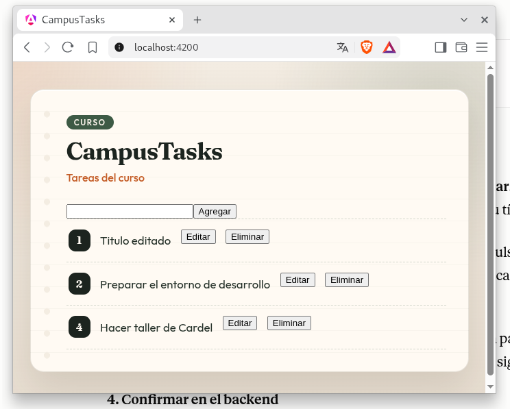

Modo edición, con el campo de texto y los botones Guardar y Cancelar:

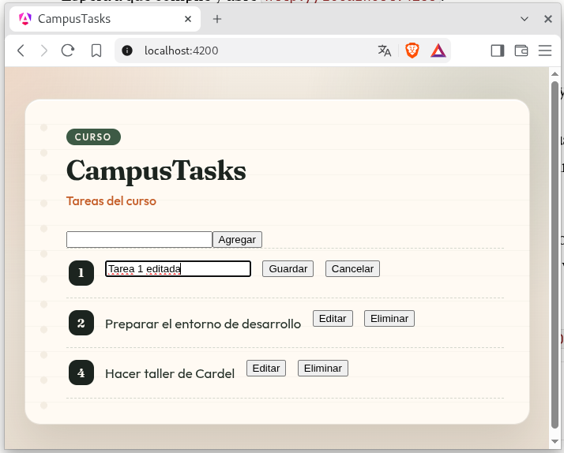

Se agrega una tarea y luego se elimina; la eliminada desaparece y las demás siguen visibles:

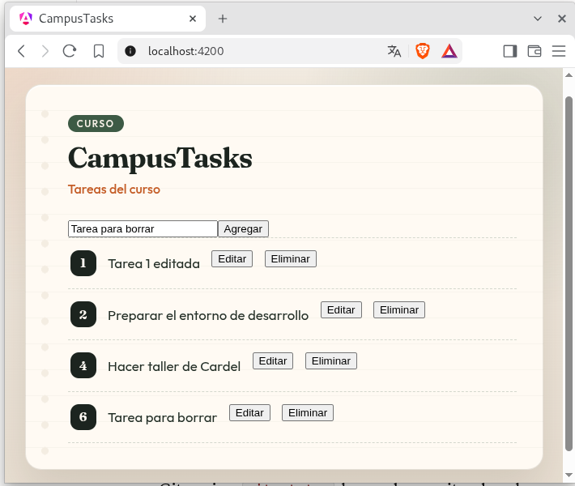

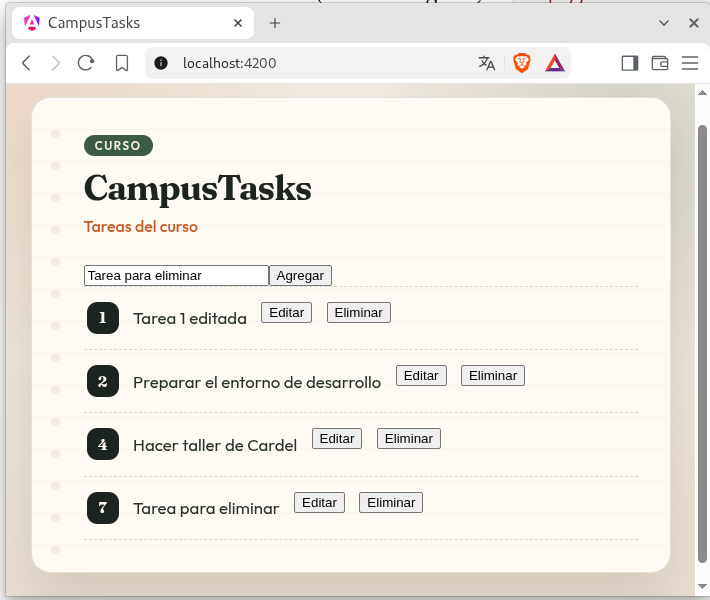

Comprobación en el backend de que los cambios quedaron en la base de datos:

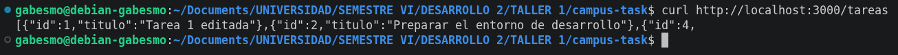

**Qué pasa en pantalla ante un error.** La lista solo cambia dentro de `next`, es decir cuando el backend responde con éxito. Si responde 404 u otro error, la lista **no cambia** y se muestra un mensaje de error. Elegí no modificar nada localmente para que la pantalla nunca muestre un estado distinto al de la base de datos.

Para comprobarlo, borré la tarea 4 desde `curl` sin recargar la página y luego pulsé **Eliminar** en esa misma tarea:

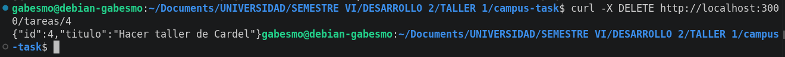

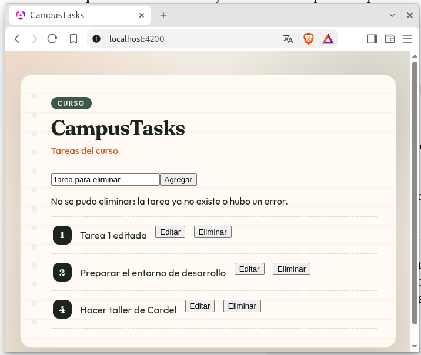

---

## 5. Pruebas

### Backend (`npm test`): 10 pruebas

| Archivo | Prueba | Qué verifica |
|---|---|---|
| `tareas.service.spec.ts` | listar (ya existía) | Devuelve las filas y llama a `query` con el SELECT |
| `tareas.service.spec.ts` | crear (ya existía) | Devuelve la fila creada y llama con el INSERT |
| `tareas.service.spec.ts` | **actualizar** | `query` recibe el UPDATE, el título y el id; devuelve la fila |
| `tareas.service.spec.ts` | **eliminar** | `query` recibe el DELETE y el id; devuelve la fila eliminada |
| `tareas.integration.spec.ts` | GET y POST (ya existían) | 200 y 201 con los cuerpos esperados |
| `tareas.integration.spec.ts` | **PATCH existente** | Envía el título, responde 200 y `query` recibe los argumentos esperados |
| `tareas.integration.spec.ts` | **PATCH inexistente** | `query` devuelve `rows` vacío y responde 404 |
| `tareas.integration.spec.ts` | **DELETE existente** | Responde 200 con la tarea eliminada y `query` recibe el id |
| `tareas.integration.spec.ts` | **DELETE inexistente** | `query` devuelve `rows` vacío y responde 404 |

El número de pruebas fue creciendo paso a paso (5, 7, 8 y finalmente 10):

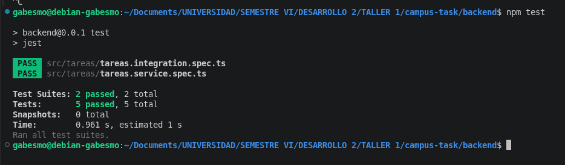

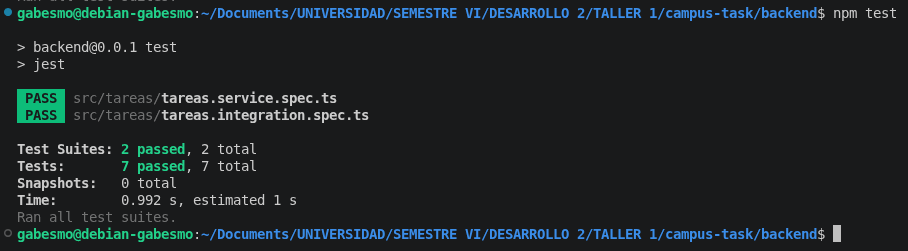

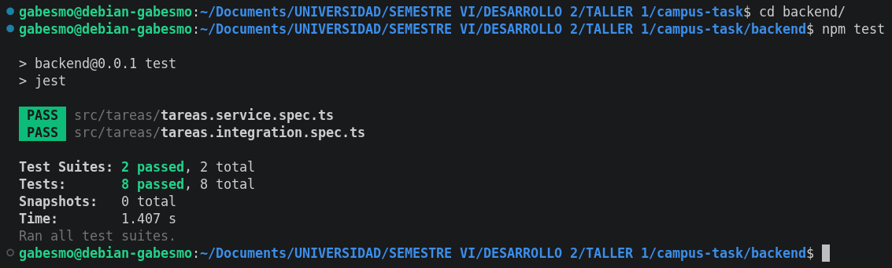

Resultado final: `Test Suites: 2 passed, 2 total` y `Tests: 10 passed, 10 total`.

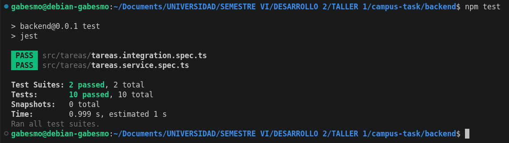

### Frontend (`npm test`): 4 pruebas

| Prueba | Qué verifica |
|---|---|
| muestra el id y el título de cada tarea (ya existía) | La lista muestra id y título |
| agrega la tarea creada al hacer clic en Agregar (ya existía) | El spy `crear` recibe el título y la tarea aparece |
| **edita el título al pulsar Editar y Guardar** | El spy `actualizar` se llamó con el id y el título nuevo, y la pantalla muestra el título actualizado |
| **elimina la tarea al pulsar Eliminar y deja las demás** | El spy `eliminar` se llamó con el id, la tarea desaparece y las demás siguen visibles |

Primero con 3 pruebas (tras agregar editar):

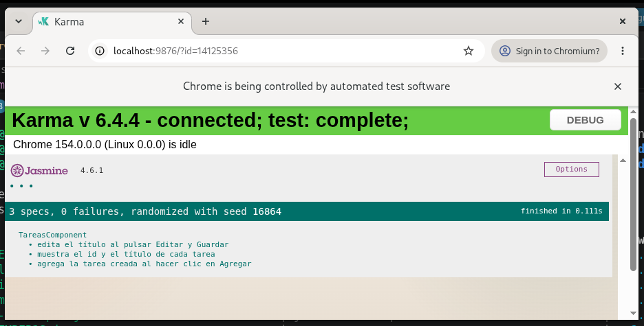

Resultado final: `4 specs, 0 failures`.

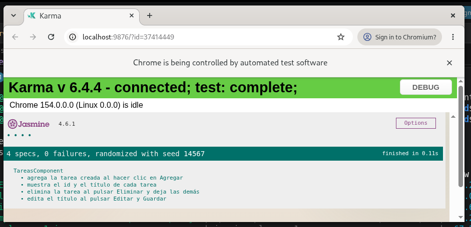

---

## 6. Git

```bash
git checkout master
git pull origin master
git checkout -b gabesmo
git status
git add backend/src frontend/src
git commit -m "Agrega editar y eliminar tareas (PATCH y DELETE /tareas/:id) en backend y frontend con sus pruebas"
git push -u origin gabesmo
```

Creación de la rama a partir de `master`:

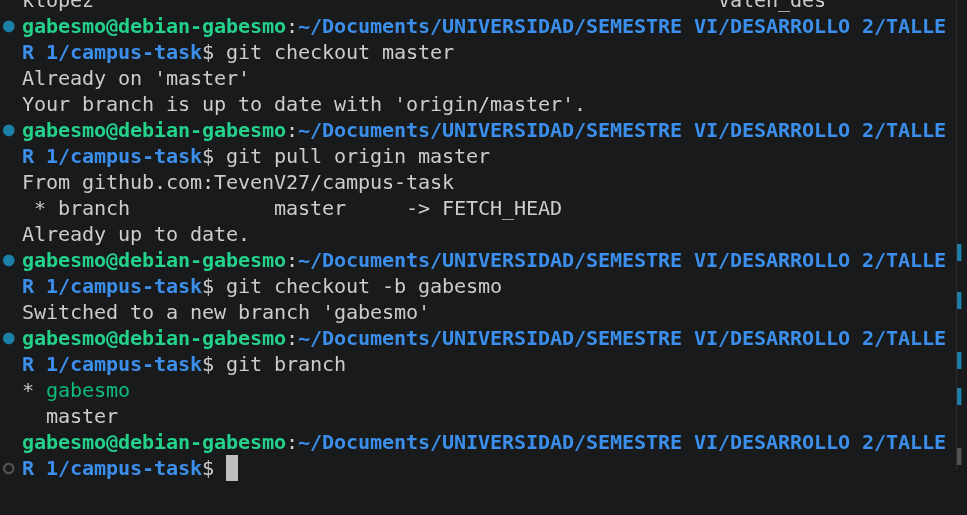

Antes del commit, `git status` mostró solo los 8 archivos modificados y no apareció `.env`. El commit (`d1b8a9e`) cambió 8 archivos y la rama se publicó en el remoto:

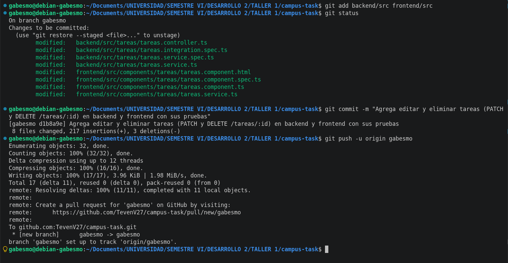

- URL de la rama: https://github.com/TevenV27/campus-task/tree/gabesmo
- URL del commit: https://github.com/TevenV27/campus-task/commit/d1b8a9e
